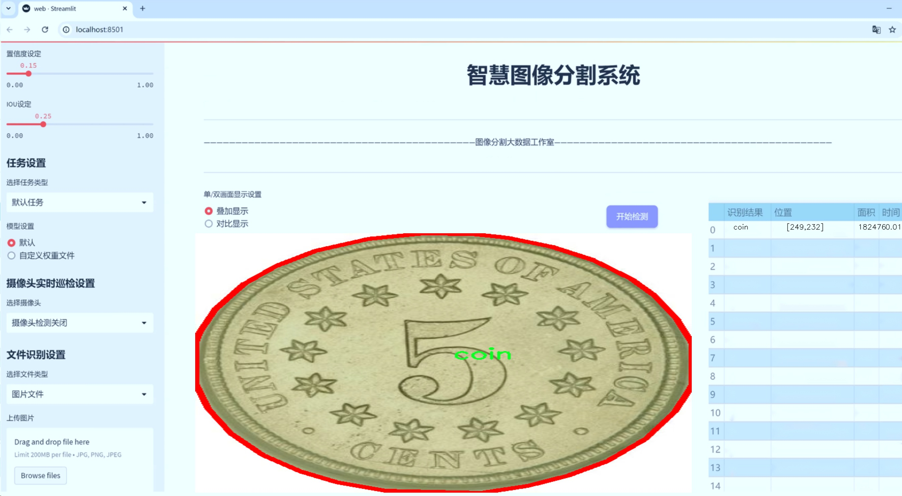
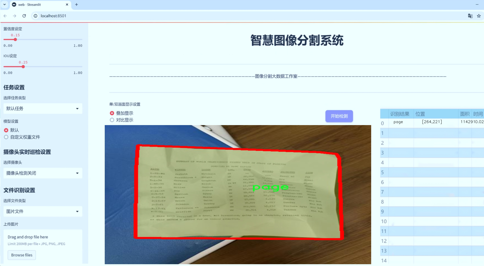
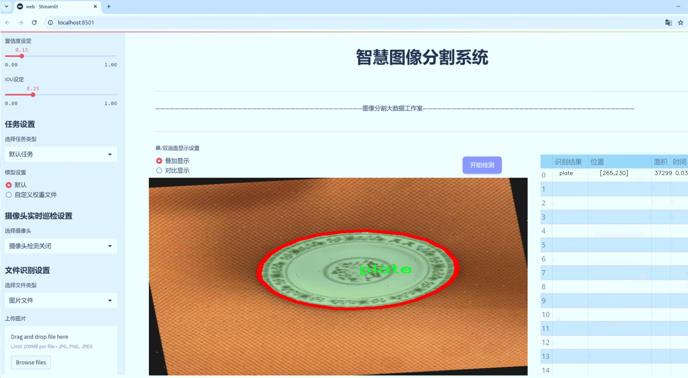
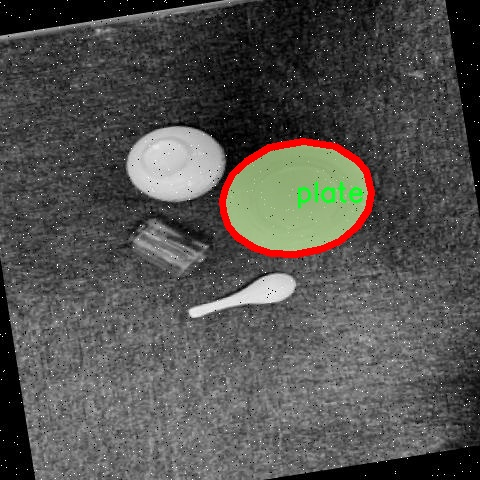
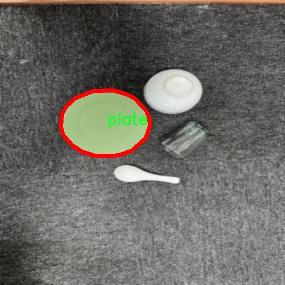
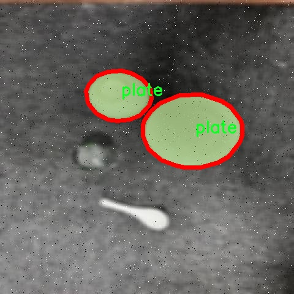
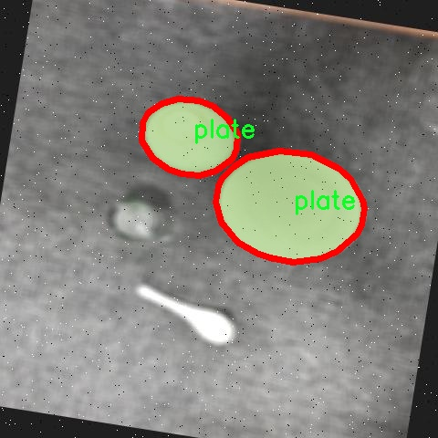
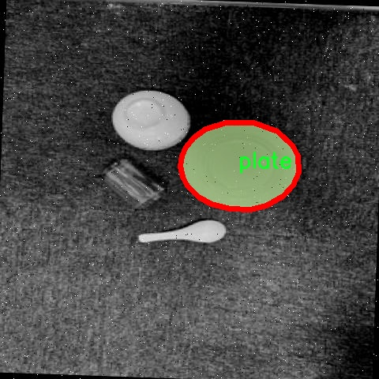

# 日常物品实例分割系统源码＆数据集分享
 [yolov8-seg-C2f-Faster＆yolov8-seg-goldyolo等50+全套改进创新点发刊_一键训练教程_Web前端展示]

### 1.研究背景与意义

项目参考[ILSVRC ImageNet Large Scale Visual Recognition Challenge](https://gitee.com/YOLOv8_YOLOv11_Segmentation_Studio/projects)

项目来源[AAAI Global Al lnnovation Contest](https://kdocs.cn/l/cszuIiCKVNis)

研究背景与意义

随着计算机视觉技术的迅猛发展，物体检测与实例分割在各个领域的应用日益广泛，尤其是在智能家居、自动驾驶、安防监控等场景中，准确识别和分割日常物品显得尤为重要。YOLO（You Only Look Once）系列模型因其高效的实时检测能力而受到广泛关注，特别是YOLOv8在精度和速度上的进一步提升，使其成为实例分割任务中的一个重要选择。然而，现有的YOLOv8模型在处理复杂背景、遮挡物体以及小物体检测等方面仍存在一定的局限性。因此，基于改进YOLOv8的日常物品实例分割系统的研究，具有重要的理论意义和实际应用价值。

本研究所使用的数据集包含8900张图像，涵盖18类日常物品，包括手臂、纸箱、硬币、立方体、圆柱体、门把手、罐子、钥匙、刀具、页面、笔、盘子、螺丝刀、衬衫、球体、正方形、三角棱柱和拉链等。这些物品不仅在日常生活中常见，而且在不同的应用场景中具有不同的识别需求。通过对这些物品进行实例分割，可以帮助系统更好地理解和处理复杂的环境信息，提高物体识别的准确性和鲁棒性。

在技术层面，本研究将通过对YOLOv8模型进行改进，结合深度学习中的数据增强、特征提取和多尺度检测等技术，提升模型在实例分割任务中的表现。具体而言，改进的方向包括优化模型的网络结构，以增强其对小物体和遮挡物体的检测能力；引入注意力机制，以提高模型对重要特征的关注度；以及采用更为丰富的数据增强策略，以提升模型的泛化能力。这些改进将使得基于YOLOv8的实例分割系统在处理日常物品时，能够实现更高的准确率和更快的处理速度。

此外，日常物品的实例分割不仅在学术研究中具有重要意义，也在实际应用中展现出广泛的前景。例如，在智能家居中，系统能够准确识别和分割不同的物品，从而实现智能控制和管理；在自动驾驶中，准确的物体检测和分割能够提高行车安全性；在安防监控中，能够有效识别潜在的安全隐患。因此，基于改进YOLOv8的日常物品实例分割系统的研究，不仅能够推动计算机视觉技术的发展，还能够为实际应用提供切实可行的解决方案。

综上所述，基于改进YOLOv8的日常物品实例分割系统的研究，既是对现有技术的挑战与创新，也是对日常生活中物品识别需求的积极响应。通过深入探索这一领域，期待能够为未来的智能化应用奠定坚实的基础，推动相关技术的进一步发展与应用。

### 2.图片演示







##### 注意：由于此博客编辑较早，上面“2.图片演示”和“3.视频演示”展示的系统图片或者视频可能为老版本，新版本在老版本的基础上升级如下：（实际效果以升级的新版本为准）

  （1）适配了YOLOV8的“目标检测”模型和“实例分割”模型，通过加载相应的权重（.pt）文件即可自适应加载模型。

  （2）支持“图片识别”、“视频识别”、“摄像头实时识别”三种识别模式。

  （3）支持“图片识别”、“视频识别”、“摄像头实时识别”三种识别结果保存导出，解决手动导出（容易卡顿出现爆内存）存在的问题，识别完自动保存结果并导出到tempDir中。

  （4）支持Web前端系统中的标题、背景图等自定义修改，后面提供修改教程。

  另外本项目提供训练的数据集和训练教程,暂不提供权重文件（best.pt）,需要您按照教程进行训练后实现图片演示和Web前端界面演示的效果。

### 3.视频演示

[3.1 视频演示](https://www.bilibili.com/video/BV1VJ2UY7ETe/)

### 4.数据集信息展示

##### 4.1 本项目数据集详细数据（类别数＆类别名）

nc: 18
names: ['arm', 'cartonbox', 'coin', 'cube', 'cylinder', 'doorhandle', 'jar', 'key', 'knife', 'page', 'pen', 'plate', 'screwdriver', 'shirt', 'sphere', 'square', 'triangularprism', 'zip']


##### 4.2 本项目数据集信息介绍

数据集信息展示

在本研究中，我们采用了名为“SHAP EYE TRACKER”的数据集，以支持改进YOLOv8-seg的日常物品实例分割系统的训练。该数据集的设计旨在提供丰富的视觉信息，涵盖了多种日常物品，进而提高模型在实例分割任务中的准确性和鲁棒性。数据集中包含18个类别，这些类别涵盖了从常见的家居物品到日常工具的广泛范围，具体包括：手臂（arm）、纸箱（cartonbox）、硬币（coin）、立方体（cube）、圆柱体（cylinder）、门把手（doorhandle）、罐子（jar）、钥匙（key）、刀具（knife）、页面（page）、笔（pen）、盘子（plate）、螺丝刀（screwdriver）、衬衫（shirt）、球体（sphere）、正方形（square）、三角棱柱（triangularprism）以及拉链（zip）等。

每个类别都经过精心挑选，以确保其在日常生活中的普遍性和代表性。数据集中的每个实例都包含丰富的标注信息，这些信息不仅包括物体的边界框，还涵盖了更为细致的分割掩码。这种高质量的标注为YOLOv8-seg模型的训练提供了坚实的基础，使其能够在复杂的场景中有效地识别和分割不同的物体。

“SHAP EYE TRACKER”数据集的多样性使其成为训练实例分割模型的理想选择。通过涵盖不同形状、大小和颜色的物体，数据集能够帮助模型学习到更为广泛的特征，从而提升其在实际应用中的表现。例如，数据集中包含的圆柱体和立方体等几何形状，能够帮助模型理解物体的空间关系，而如门把手和钥匙等日常工具则有助于模型在复杂环境中进行准确识别。

此外，数据集的设计还考虑到了不同光照条件和背景环境的变化，使得模型在各种实际应用场景中都能保持良好的性能。这种对环境多样性的关注，不仅提高了模型的适应性，也增强了其实用性，确保其能够在真实世界中有效地执行实例分割任务。

在训练过程中，我们将利用“SHAP EYE TRACKER”数据集的丰富信息，通过不断迭代和优化，提升YOLOv8-seg模型的性能。我们相信，借助这一高质量的数据集，模型将能够在日常物品的实例分割任务中实现更高的准确率和更快的处理速度，为未来的智能视觉系统提供强有力的支持。

综上所述，“SHAP EYE TRACKER”数据集不仅为我们的研究提供了宝贵的资源，也为实例分割领域的进一步发展奠定了基础。通过对该数据集的深入分析和有效利用，我们期待能够推动YOLOv8-seg模型在日常物品识别和分割方面的进步，最终实现更为智能化的视觉识别系统。











### 5.全套项目环境部署视频教程（零基础手把手教学）

[5.1 环境部署教程链接（零基础手把手教学）](https://www.bilibili.com/video/BV1jG4Ve4E9t/?vd_source=bc9aec86d164b67a7004b996143742dc)


[5.2 安装Python虚拟环境创建和依赖库安装视频教程链接（零基础手把手教学）](https://www.bilibili.com/video/BV1nA4VeYEze/?vd_source=bc9aec86d164b67a7004b996143742dc)

### 6.手把手YOLOV8-seg训练视频教程（零基础小白有手就能学会）

[6.1 手把手YOLOV8-seg训练视频教程（零基础小白有手就能学会）](https://www.bilibili.com/video/BV1cA4VeYETe/?vd_source=bc9aec86d164b67a7004b996143742dc)


按照上面的训练视频教程链接加载项目提供的数据集，运行train.py即可开始训练



     Epoch   gpu_mem       box       obj       cls    labels  img_size
     1/200     0G   0.01576   0.01955  0.007536        22      1280: 100%|██████████| 849/849 [14:42<00:00,  1.04s/it]
               Class     Images     Labels          P          R     mAP@.5 mAP@.5:.95: 100%|██████████| 213/213 [01:14<00:00,  2.87it/s]
                 all       3395      17314      0.994      0.957      0.0957      0.0843

     Epoch   gpu_mem       box       obj       cls    labels  img_size
     2/200     0G   0.01578   0.01923  0.007006        22      1280: 100%|██████████| 849/849 [14:44<00:00,  1.04s/it]
               Class     Images     Labels          P          R     mAP@.5 mAP@.5:.95: 100%|██████████| 213/213 [01:12<00:00,  2.95it/s]
                 all       3395      17314      0.996      0.956      0.0957      0.0845

     Epoch   gpu_mem       box       obj       cls    labels  img_size
     3/200     0G   0.01561    0.0191  0.006895        27      1280: 100%|██████████| 849/849 [10:56<00:00,  1.29it/s]
               Class     Images     Labels          P          R     mAP@.5 mAP@.5:.95: 100%|███████   | 187/213 [00:52<00:00,  4.04it/s]
                 all       3395      17314      0.996      0.957      0.0957      0.0845


### 7.50+种全套YOLOV8-seg创新点代码加载调参视频教程（一键加载写好的改进模型的配置文件）

[7.1 50+种全套YOLOV8-seg创新点代码加载调参视频教程（一键加载写好的改进模型的配置文件）](https://www.bilibili.com/video/BV1Hw4VePEXv/?vd_source=bc9aec86d164b67a7004b996143742dc)

### 8.YOLOV8-seg图像分割算法原理

原始YOLOv8-seg算法原理

YOLOv8-seg算法是YOLO系列目标检测算法的最新进展，旨在实现更高效的图像分割与目标检测。作为YOLOv5的继承者，YOLOv8在多个方面进行了改进和优化，结合了深度学习领域的最新研究成果，使其在精度和速度上均有显著提升。该算法的核心在于其创新的网络结构、数据处理方式和损失函数设计，特别是在分割任务中，YOLOv8-seg通过对特征提取和标签分配策略的优化，提升了对复杂场景的处理能力。

首先，YOLOv8-seg在数据预处理阶段延续了YOLOv5的成功经验，采用了多种数据增强技术。这些技术包括马赛克增强、混合增强、空间扰动和颜色扰动等，旨在通过多样化的训练样本来提高模型的鲁棒性和泛化能力。尤其是马赛克增强，它通过将多张图像拼接成一张新的图像，增加了模型对不同物体和背景的适应性。然而，YOLOv8-seg在训练的最后阶段停止使用马赛克增强，以避免对数据真实分布的干扰，从而确保模型学习到的特征更加准确。

在网络结构方面，YOLOv8-seg引入了新的C2f模块，替代了YOLOv5中的C3模块。C2f模块通过增加更多的分支，丰富了梯度回传的路径，提升了特征提取的效率。这种设计不仅保持了模型的轻量化，还增强了特征流动性，使得模型在处理复杂图像时能够更好地捕捉细节信息。此外，YOLOv8-seg依然采用了FPN-PAN结构，以实现多尺度特征的融合，确保在不同分辨率下的物体检测和分割任务都能获得良好的效果。

YOLOv8-seg的检测头结构也经历了重要的变革。与以往的耦合头不同，YOLOv8-seg采用了解耦头的设计，分别处理分类和定位任务。这种结构的优势在于，分类任务更注重特征的相似性，而定位任务则关注边界框与真实框之间的关系。通过这种方式，模型在训练过程中能够更快地收敛，并提高预测的精度。此外，YOLOv8-seg还引入了无锚框结构，直接预测目标的中心位置，并通过任务对齐学习（TAL）来优化正负样本的区分，进一步提升了检测的准确性。

在标签分配策略上，YOLOv8-seg采用了动态标签分配方法，解决了传统候选框聚类方法在数据集不足时可能导致的匹配不准确问题。通过使用TOOD策略，YOLOv8-seg能够更有效地进行正负样本的匹配，从而提高模型的学习效率。其损失函数设计也体现了这一点，分类损失采用了变焦损失（VFL Loss），而回归损失则结合了CIoULoss与DFLLoss，确保模型在训练过程中能够平衡分类和定位的精度。

YOLOv8-seg的创新之处不仅体现在算法本身，还在于其在实际应用中的表现。以苹果采摘为例，YOLOv8-seg通过其强大的视觉识别能力，能够自动检测和定位苹果，为自动采摘机器人提供精准的目标信息。同时，结合蚁群算法进行路径规划，使得机器人能够高效地完成采摘任务。这一应用展示了YOLOv8-seg在农业自动化领域的潜力，表明其不仅限于传统的目标检测任务，还能够扩展到更复杂的场景中。

总的来说，YOLOv8-seg算法通过一系列的结构优化和策略调整，提升了目标检测和图像分割的性能。其在数据预处理、网络结构、标签分配和损失函数等方面的创新，使得YOLOv8-seg在实时检测和高精度要求的应用场景中表现出色。随着深度学习技术的不断发展，YOLOv8-seg无疑将在未来的目标检测和图像分割领域发挥重要作用，为各类智能应用提供强有力的支持。


### 9.系统功能展示（检测对象为举例，实际内容以本项目数据集为准）

图9.1.系统支持检测结果表格显示

  图9.2.系统支持置信度和IOU阈值手动调节

  图9.3.系统支持自定义加载权重文件best.pt(需要你通过步骤5中训练获得)

  图9.4.系统支持摄像头实时识别

  图9.5.系统支持图片识别

  图9.6.系统支持视频识别

  图9.7.系统支持识别结果文件自动保存

  图9.8.系统支持Excel导出检测结果数据


### 10.50+种全套YOLOV8-seg创新点原理讲解（非科班也可以轻松写刊发刊，V11版本正在科研待更新）

#### 10.1 由于篇幅限制，每个创新点的具体原理讲解就不一一展开，具体见下列网址中的创新点对应子项目的技术原理博客网址【Blog】：


[10.1 50+种全套YOLOV8-seg创新点原理讲解链接](https://gitee.com/qunmasj/good)

#### 10.2 部分改进模块原理讲解(完整的改进原理见上图和技术博客链接)【如果此小节的图加载失败可以通过CSDN或者Github搜索该博客的标题访问原始博客，原始博客图片显示正常】

### YOLOv8模型
YOLOv8模型由Ultralytics团队在YOLOv5模型的基础上，吸收了近两年半来经过实际验证的各种改进，于2023年1月提出。与之前的一些YOLO 系列模型想类似，YOLOv8模型也有多种尺寸，下面以YOLOv8n为例，分析 YOLOv8模型的结构和改进点。YOLOv8模型网络结构如
输入图片的部分，由于发现Mosaic数据增强尽管这有助于提升模型的鲁棒性和泛化性，但是，在一定程度上，也会破坏数据的真实分布，使得模型学习到一些不好的信息。所以YOLOv8模型在训练中的最后10个epoch 停止使用Mosaic数据增强。


在网络结构上，首先主干网络的改变不大，主要是将C3模块替换为了C2f模块，该模块的结构在上图中已示出。C2f模块在C3模块的思路基础上，引入了YOLOv7中 ELAN的思路，引入了更多的跳层连接，这有助于该模块获得更丰富的梯度流信息，而且模型的轻量化得到了保证。依然保留了SPPF，效果不变的同时减少了该模块的执行时间。
在颈部网络中，也是将所有的C3模块更改为C2f模块，同时删除了两处上采样之前的卷积连接层。
在头部网络中，采用了YOLOX中使用的解耦头的思路，两条并行的分支分别提取类别和位置特征。由于分类任务更注重于分析特征图中提取到的特征与已输入图片的部分，由于发现 Mosaic数据增强尽管这有助于提升模型的鲁棒性和泛化性，但是，在一定程度上，也会破坏数据的真实分布，使得模型学习到一些不好的信息。所以YOLOv8模型在训练中的最后10个epoch停止使用Mosaic数据增强。
在网络结构上，首先主干网络的改变不大，主要是将C3模块替换为了C2f模块，该模块的结构在上图中已示出。C2f模块在C3模块的思路基础上，引入了YOLOv7中ELAN的思路，引入了更多的跳层连接，这有助于该模块获得更丰富的梯度流信息，而且模型的轻量化得到了保证。依然保留了SPPF，效果不变的同时减少了该模块的执行时间。
在颈部网络中，也是将所有的C3模块更改为C2f模块，同时删除了两处上采样之前的卷积连接层。
在头部网络中，采用了YOLOX中使用的解耦头的思路，两条并行的分支分别提取类别和位置特征。由于分类任务更注重于分析特征图中提取到的特征与已有类别中的哪一种更为相似，而定位任务更关注边界框与真值框的位置关系，并据此对边界框的坐标进行调整。侧重点的不同使得在使用两个检测头时收敛的速度和预测的精度有所提高。而且使用了无锚框结构，直接预测目标的中心，并使用TAL (Task Alignment Learning，任务对齐学习）来区分正负样本，引入了分类分数和IOU的高次幂乘积作为衡量任务对齐程度的指标，认为同时拥有好的定位和分类评价的在分类和定位损失函数中也引入了这项指标。
在模型的检测结果上，YOLOv8模型也取得了较好的成果，图为官方在coCO数据集上 YOLOv8模型的模型尺寸大小和检测的mAP50-95对比图。mAP50-95指的是IOU的值从50%取到95%，步长为5%，然后算在这些IOU下的mAP的均值。图的 a）图展示了YOLOv8在同尺寸下模型中参数没有较大增加的前提下取得了比其他模型更好的精度，图2-17的b)图展示了YOLOv8比其他YOLO系列模型在同尺寸时，推理速度更快且精度没有太大下降。


### 视觉transformer(ViT)简介
视觉transformer(ViT)最近在各种计算机视觉任务中证明了巨大的成功，并受到了相当多的关注。与卷积神经网络(CNNs)相比，ViT具有更强的全局信息捕获能力和远程交互能力，表现出优于CNNs的准确性，特别是在扩大训练数据大小和模型大小时[An image is worth 16x16 words: Transformers for image recognition at scale,Coatnet]。

尽管ViT在低分辨率和高计算领域取得了巨大成功，但在高分辨率和低计算场景下，ViT仍不如cnn。例如，下图(左)比较了COCO数据集上当前基于cnn和基于vit的一级检测器。基于vit的检测器(160G mac)和基于cnn的检测器(6G mac)之间的效率差距超过一个数量级。这阻碍了在边缘设备的实时高分辨率视觉应用程序上部署ViT。


左图:现有的基于vit的一级检测器在实时目标检测方面仍然不如当前基于cnn的一级检测器，需要的计算量多出一个数量级。本文引入了第一个基于vit的实时对象检测器来弥补这一差距。在COCO上，efficientvit的AP比efficientdet高3.8，而mac较低。与YoloX相比，efficient ViT节省67.2%的计算成本，同时提供更高的AP。

中:随着输入分辨率的增加，计算成本呈二次增长，无法有效处理高分辨率的视觉应用。

右图:高分辨率对图像分割很重要。当输入分辨率从1024x2048降低到512x1024时，MobileNetV2的mIoU减少12% (8.5 mIoU)。在不提高分辨率的情况下，只提高模型尺寸是无法缩小性能差距的。

ViT的根本计算瓶颈是softmax注意模块，其计算成本随输入分辨率的增加呈二次增长。例如，如上图(中)所示，随着输入分辨率的增加，vit- small[Pytorch image models. https://github.com/rwightman/ pytorch-image-models]的计算成本迅速显著大于ResNet-152的计算成本。

解决这个问题的一个直接方法是降低输入分辨率。然而，高分辨率的视觉识别在许多现实世界的计算机视觉应用中是必不可少的，如自动驾驶，医疗图像处理等。当输入分辨率降低时，图像中的小物体和精细细节会消失，导致目标检测和语义分割性能显著下降。

上图(右)显示了在cityscape数据集上不同输入分辨率和宽度乘法器下MobileNetV2的性能。例如，将输入分辨率从1024x2048降低到512x1024会使cityscape的性能降低12% (8.5 mIoU)。即使是3.6倍高的mac，只放大模型尺寸而不增加分辨率也无法弥补这一性能损失。

除了降低分辨率外，另一种代表性的方法是限制softmax注意，方法是将其范围限制在固定大小的局部窗口内[Swin transformer,Swin transformer v2]或降低键/值张量的维数[Pyramid vision transformer,Segformer]。然而，它损害了ViT的非局部注意能力，降低了全局接受域(ViT最重要的优点)，使得ViT与大内核cnn的区别更小[A convnet for the 2020s,Scaling up your kernels to 31x31: Revisiting large kernel design in cnns,Lite pose: Efficient architecture design for 2d human pose estimation]。

本文介绍了一个有效的ViT体系结构，以解决这些挑战。发现没有必要坚持softmax注意力。本文建议用线性注意[Transformers are rnns: Fast autoregressive transformers with linear attention]代替softmax注意。

线性注意的关键好处是，它保持了完整的n 2 n^2n 2
 注意映射，就像softmax注意。同时，它利用矩阵乘法的联想特性，避免显式计算完整的注意映射，同时保持相同的功能。因此，它保持了softmax注意力的全局特征提取能力，且计算复杂度仅为线性。线性注意的另一个关键优点是它避免了softmax，这使得它在移动设备上更有效(下图左)。


左图:线性注意比类似mac下的softmax注意快3.3-4.5倍，这是因为去掉了硬件效率不高的softmax功能。延迟是在Qualcomm Snapdragon 855 CPU和TensorFlow-Lite上测量的。本文增加线性注意的头部数量，以确保它具有与softmax注意相似的mac。

中:然而，如果没有softmax注意中使用的非线性注意评分归一化，线性注意无法有效集中其注意分布，削弱了其局部特征提取能力。后文提供了可视化。

右图:本文用深度卷积增强线性注意，以解决线性注意的局限性。深度卷积可以有效地捕捉局部特征，而线性注意可以专注于捕捉全局信息。增强的线性注意在保持线性注意的效率和简单性的同时，表现出在各种视觉任务上的强大表现(图4)。

然而，直接应用线性注意也有缺点。以往的研究表明线性注意和softmax注意之间存在显著的性能差距(下图中间)。


左:高通骁龙855上的精度和延迟权衡。效率vit比效率网快3倍，精度更高。中:ImageNet上softmax注意与线性注意的比较。在相同的计算条件下，本文观察到softmax注意与线性注意之间存在显著的精度差距。而深度卷积增强模型后，线性注意的精度有明显提高。

相比之下，softmax注意的精度变化不大。在相同MAC约束下，增强线性注意比增强软最大注意提高了0.3%的精度。右图:与增强的softmax注意相比，增强的线性注意硬件效率更高，随着分辨率的增加，延迟增长更慢。

深入研究线性注意和softmax注意的详细公式，一个关键的区别是线性注意缺乏非线性注意评分归一化方案。这使得线性注意无法有效地将注意力分布集中在局部模式产生的高注意分数上，从而削弱了其局部特征提取能力。

本文认为这是线性注意的主要限制，使其性能不如softmax注意。本文提出了一个简单而有效的解决方案来解决这一限制，同时保持线性注意在低复杂度和低硬件延迟方面的优势。具体来说，本文建议通过在每个FFN层中插入额外的深度卷积来增强线性注意。因此，本文不需要依赖线性注意进行局部特征提取，避免了线性注意在捕捉局部特征方面的不足，并利用了线性注意在捕捉全局特征方面的优势。

本文广泛评估了efficient vit在低计算预算下对各种视觉任务的有效性，包括COCO对象检测、城市景观语义分割和ImageNet分类。本文想要突出高效的主干设计，所以没有包括任何正交的附加技术(例如，知识蒸馏，神经架构搜索)。尽管如此，在COCO val2017上，efficientvit的AP比efficientdet - d1高2.4倍，同时节省27.9%的计算成本。在cityscape上，efficientvit提供了比SegFormer高2.5个mIoU，同时降低了69.6%的计算成本。在ImageNet上，efficientvit在584M mac上实现了79.7%的top1精度，优于efficientnet - b1的精度，同时节省了16.6%的计算成本。

与现有的以减少参数大小或mac为目标的移动ViT模型[Mobile-former,Mobilevit,NASVit]不同，本文的目标是减少移动设备上的延迟。本文的模型不涉及复杂的依赖或硬件低效操作。因此，本文减少的计算成本可以很容易地转化为移动设备上的延迟减少。

在高通骁龙855 CPU上，efficient vit运行速度比efficientnet快3倍，同时提供更高的ImageNet精度。本文的代码和预训练的模型将在出版后向公众发布。

### Efficient Vision Transformer.
提高ViT的效率对于在资源受限的边缘平台上部署ViT至关重要，如手机、物联网设备等。尽管ViT在高计算区域提供了令人印象深刻的性能，但在针对低计算区域时，它通常不如以前高效的cnn[Efficientnet, mobilenetv3,Once for all: Train one network and specialize it for efficient deployment]。为了缩小差距，MobileViT建议结合CNN和ViT的长处，使用transformer将卷积中的局部处理替换为全局处理。MobileFormer提出了在MobileNet和Transformer之间建立双向桥以实现特征融合的并行化。NASViT提出利用神经架构搜索来搜索高效的ViT架构。

这些模型在ImageNet上提供了极具竞争力的准确性和效率的权衡。然而，它们并不适合高分辨率的视觉任务，因为它们仍然依赖于softmax注意力。


在本节中，本文首先回顾了自然语言处理中的线性注意，并讨论了它的优缺点。接下来，本文介绍了一个简单而有效的解决方案来克服线性注意的局限性。最后，给出了efficient vit的详细架构。

 为可学习投影矩阵。Oi表示矩阵O的第i行。Sim(·，·)为相似度函数。

虽然softmax注意力在视觉和NLP方面非常成功，但它并不是唯一的选择。例如，线性注意提出了如下相似度函数:


其中，φ(·)为核函数。在本工作中，本文选择了ReLU作为内核函数，因为它对硬件来说是友好的。当Sim(Q, K) = φ(Q)φ(K)T时，式(1)可改写为:


线性注意的一个关键优点是，它允许利用矩阵乘法的结合律，在不改变功能的情况下，将计算复杂度从二次型降低到线性型:


除了线性复杂度之外，线性注意的另一个关键优点是它不涉及注意模块中的softmax。Softmax在硬件上效率非常低。避免它可以显著减少延迟。例如，下图(左)显示了softmax注意和线性注意之间的延迟比较。在类似的mac上，线性注意力比移动设备上的softmax注意力要快得多。


#### EfficientViT
Enhancing Linear Attention with Depthwise Convolution

虽然线性注意在计算复杂度和硬件延迟方面优于softmax注意，但线性注意也有局限性。以往的研究[\[Luna: Linear unified nested attention,Random feature attention,Combiner: Full attention transformer with sparse computation cost,cosformer: Rethinking softmax in attention\]](https://afdian.net/item/602b9612927111ee9ec55254001e7c00)表明，在NLP中线性注意和softmax注意之间通常存在显著的性能差距。对于视觉任务，之前的研究[Visual correspondence hallucination,Quadtree attention for vision transformers]也表明线性注意不如softmax注意。在本文的实验中，本文也有类似的观察结果(图中)。


本文对这一假设提出了质疑，认为线性注意的低劣性能主要是由于局部特征提取能力的丧失。如果没有在softmax注意中使用的非线性评分归一化，线性注意很难像softmax注意那样集中其注意分布。下图(中间)提供了这种差异的示例。


在相同的原始注意力得分下，使用softmax比不使用softmax更能集中注意力。因此，线性注意不能有效地聚焦于局部模式产生的高注意分数(下图)，削弱了其局部特征提取能力。


注意图的可视化显示了线性注意的局限性。通过非线性注意归一化，softmax注意可以产生清晰的注意分布，如中间行所示。相比之下，线性注意的分布相对平滑，使得线性注意在捕捉局部细节方面的能力较弱，造成了显著的精度损失。本文通过深度卷积增强线性注意来解决这一限制，并有效提高了准确性。

介绍了一个简单而有效的解决方案来解决这个限制。本文的想法是用卷积增强线性注意，这在局部特征提取中是非常有效的。这样，本文就不需要依赖于线性注意来捕捉局部特征，而可以专注于全局特征提取。具体来说，为了保持线性注意的效率和简单性，本文建议在每个FFN层中插入一个深度卷积，这样计算开销很小，同时极大地提高了线性注意的局部特征提取能力。

#### Building Block

下图(右)展示了增强线性注意的详细架构，它包括一个线性注意层和一个FFN层，在FFN的中间插入深度卷积。


与之前的方法[Swin transformer,Coatnet]不同，本文在efficientvit中没有使用相对位置偏差。相对位置偏差虽然可以改善模型的性能，但它使模型容易受到分辨率变化[Segformer]的影响。多分辨率训练或新分辨率下的测试在检测和分割中很常见。去除相对位置偏差使高效率vit对输入分辨率更加灵活。

与之前低计算CNNs[Mobilenetv2,mobilenetv3]的设计不同，本文为下采样块添加了额外的下采样快捷方式。每个下采样快捷方式由一个平均池和一个1x1卷积组成。在本文的实验中，这些额外的下采样快捷方式可以稳定训练效率，提高性能。

#### Macro Architecture

下图说明了efficientvit的宏观体系结构。它由输入 stem 和4级组成。最近的研究[Coatnet,Levit,Early convolutions help transformers see better]表明在早期阶段使用卷积对ViT更好。本文遵循这个设计，在第三阶段开始使用增强的线性注意。


EfficientViT宏观架构。本文从第三阶段开始使用增强的线性注意。P2、P3和P4形成了一个金字塔特征图，用于检测和分割。P4用于分类。

为了突出高效的主干本身，本文对MBConv和FFN使用相同的扩展比e (e = 4)保持超参数简单，对所有深度卷积使用相同的内核大小k(除了输入stem)，对所有层使用相同的激活函数(hard swish)。

P2、P3和P4表示阶段2、3和4的输出，形成了特征图的金字塔。本文按照惯例将P2、P3和P4送至检测头。本文使用Yolov8进行检测。为了分割，本文融合了P2和P4。融合特征被馈送到一个轻量级头，包括几个卷积层，遵循Fast-SCNN。为了分类，本文将P4输入到轻量级头部，与MobileNetV3相同。


### 11.项目核心源码讲解（再也不用担心看不懂代码逻辑）

#### 11.1 ultralytics\cfg\__init__.py

以下是经过精简和注释的核心代码部分，保留了最重要的功能和逻辑：

```python
# 导入必要的库
import sys
from pathlib import Path
from types import SimpleNamespace
from typing import Dict, Union
from ultralytics.utils import yaml_load, LOGGER, DEFAULT_CFG_DICT, checks, colorstr

# 定义有效的任务和模式
MODES = 'train', 'val', 'predict', 'export', 'track', 'benchmark'
TASKS = 'detect', 'segment', 'classify', 'pose'

def cfg2dict(cfg):
    """
    将配置对象转换为字典格式，可以是文件路径、字符串或SimpleNamespace对象。

    Args:
        cfg (str | Path | dict | SimpleNamespace): 要转换的配置对象。

    Returns:
        cfg (dict): 转换后的字典格式配置对象。
    """
    if isinstance(cfg, (str, Path)):
        cfg = yaml_load(cfg)  # 从文件加载字典
    elif isinstance(cfg, SimpleNamespace):
        cfg = vars(cfg)  # 转换为字典
    return cfg

def get_cfg(cfg: Union[str, Path, Dict, SimpleNamespace] = DEFAULT_CFG_DICT, overrides: Dict = None):
    """
    加载并合并配置数据。

    Args:
        cfg (str | Path | Dict | SimpleNamespace): 配置数据。
        overrides (Dict | optional): 覆盖的配置。

    Returns:
        (SimpleNamespace): 训练参数的命名空间。
    """
    cfg = cfg2dict(cfg)  # 转换配置为字典

    # 合并覆盖的配置
    if overrides:
        overrides = cfg2dict(overrides)
        cfg = {**cfg, **overrides}  # 合并字典

    # 类型和值检查
    for k, v in cfg.items():
        if v is not None:  # 忽略None值
            if k in CFG_FLOAT_KEYS and not isinstance(v, (int, float)):
                raise TypeError(f"'{k}={v}' 类型无效，必须是 int 或 float")
            # 其他类型检查...

    return SimpleNamespace(**cfg)  # 返回命名空间

def entrypoint(debug=''):
    """
    Ultralytics包的入口函数，负责解析命令行参数。

    Args:
        debug (str): 调试模式下的参数。
    """
    args = (debug.split(' ') if debug else sys.argv)[1:]  # 获取命令行参数
    if not args:  # 如果没有参数
        LOGGER.info("请提供有效的参数。")
        return

    overrides = {}  # 存储覆盖的参数
    for a in args:
        if '=' in a:
            k, v = a.split('=', 1)  # 解析键值对
            overrides[k] = v  # 存储覆盖参数
        elif a in TASKS:
            overrides['task'] = a  # 任务参数
        elif a in MODES:
            overrides['mode'] = a  # 模式参数

    # 检查模式和任务的有效性
    mode = overrides.get('mode', 'predict')  # 默认模式为predict
    task = overrides.get('task', None)  # 获取任务

    # 运行相应的模型方法
    model = ...  # 根据任务加载模型
    getattr(model, mode)(**overrides)  # 执行指定模式

if __name__ == '__main__':
    entrypoint()  # 运行入口函数
```

### 代码注释说明：
1. **导入部分**：导入了必要的库和模块，确保后续功能的实现。
2. **配置转换函数 `cfg2dict`**：将不同类型的配置对象转换为字典格式，方便后续处理。
3. **获取配置函数 `get_cfg`**：加载配置并合并覆盖的参数，同时进行类型和值的检查，确保参数有效。
4. **入口函数 `entrypoint`**：处理命令行参数，解析任务和模式，并根据输入调用相应的模型方法执行操作。
5. **主程序入口**：在脚本直接运行时调用 `entrypoint` 函数。

通过这样的精简和注释，代码的核心逻辑和功能得以保留，同时也使得代码的可读性和可维护性提高。

这个文件是Ultralytics YOLO项目的配置模块，主要用于处理与YOLO模型相关的配置和命令行参数。文件开头包含了一些导入语句，这些语句引入了必要的库和工具，例如用于路径处理的`Path`，用于日志记录的`LOGGER`，以及一些配置相关的工具函数。

在文件中，首先定义了一些有效的任务和模式。任务包括目标检测（detect）、分割（segment）、分类（classify）和姿态估计（pose），而模式则包括训练（train）、验证（val）、预测（predict）、导出（export）、跟踪（track）和基准测试（benchmark）。这些任务和模式在后续的配置和命令行解析中会被使用。

接下来，文件定义了一些用于配置参数类型检查的键，例如浮点数、整数和布尔值的键。这些键将用于验证用户输入的配置参数是否符合预期的类型。

`cfg2dict`函数用于将配置对象转换为字典格式，无论输入是文件路径、字符串还是`SimpleNamespace`对象。`get_cfg`函数则用于加载和合并配置数据，支持从文件或字典中读取配置，并允许用户通过覆盖参数来修改默认配置。

`get_save_dir`函数用于根据训练、验证或预测的参数生成保存目录，确保每次运行时生成的目录不会冲突。`_handle_deprecation`函数处理已弃用的配置键，确保向后兼容性。

`check_dict_alignment`函数用于检查自定义配置与基础配置之间的键是否匹配，若有不匹配的键则会给出提示并终止程序。`merge_equals_args`函数则用于合并参数列表中的等号参数，确保参数格式正确。

文件还包含了处理Ultralytics HUB和YOLO设置的函数，这些函数允许用户通过命令行与Ultralytics HUB进行交互，或者重置和更新YOLO的设置。

`entrypoint`函数是整个模块的入口点，负责解析命令行参数并执行相应的操作。它支持传递YOLO所需的参数，并根据用户输入的任务和模式执行相应的模型操作。函数中还包含了对参数的验证和默认值的处理，确保用户输入的参数有效且完整。

最后，文件定义了一个特殊的模式函数`copy_default_cfg`，用于复制默认配置文件，以便用户可以在此基础上进行修改。

总的来说，这个文件是Ultralytics YOLO项目的核心配置和命令行处理模块，负责管理模型的配置、参数验证以及与用户交互的命令行接口。

#### 11.2 ultralytics\nn\modules\head.py

以下是代码中最核心的部分，并附上详细的中文注释：

```python
import torch
import torch.nn as nn

class Detect(nn.Module):
    """YOLOv8 检测头，用于目标检测模型。"""
    
    def __init__(self, nc=80, ch=()):
        """初始化 YOLOv8 检测层，指定类别数和通道数。
        
        参数:
            nc (int): 类别数，默认是 80。
            ch (tuple): 输入通道数的元组。
        """
        super().__init__()
        self.nc = nc  # 类别数
        self.nl = len(ch)  # 检测层的数量
        self.reg_max = 16  # DFL 通道数
        self.no = nc + self.reg_max * 4  # 每个锚点的输出数量
        self.stride = torch.zeros(self.nl)  # 在构建过程中计算的步幅
        c2, c3 = max((16, ch[0] // 4, self.reg_max * 4)), max(ch[0], min(self.nc, 100))  # 通道数
        # 定义 cv2 和 cv3 模块列表，分别用于回归和分类
        self.cv2 = nn.ModuleList(
            nn.Sequential(Conv(x, c2, 3), Conv(c2, c2, 3), nn.Conv2d(c2, 4 * self.reg_max, 1)) for x in ch)
        self.cv3 = nn.ModuleList(nn.Sequential(Conv(x, c3, 3), Conv(c3, c3, 3), nn.Conv2d(c3, self.nc, 1)) for x in ch)
        self.dfl = DFL(self.reg_max) if self.reg_max > 1 else nn.Identity()  # DFL 层

    def forward(self, x):
        """连接并返回预测的边界框和类别概率。
        
        参数:
            x (list): 输入特征图的列表。
        
        返回:
            y (tensor): 预测的边界框和类别概率。
        """
        shape = x[0].shape  # 获取输入的形状
        for i in range(self.nl):
            # 将 cv2 和 cv3 的输出进行拼接
            x[i] = torch.cat((self.cv2[i](x[i]), self.cv3[i](x[i])), 1)
        
        # 如果是训练模式，直接返回
        if self.training:
            return x
        
        # 如果动态重建或形状变化，计算锚点和步幅
        elif self.dynamic or self.shape != shape:
            self.anchors, self.strides = (x.transpose(0, 1) for x in make_anchors(x, self.stride, 0.5))
            self.shape = shape

        # 将所有层的输出拼接在一起
        x_cat = torch.cat([xi.view(shape[0], self.no, -1) for xi in x], 2)
        # 分割边界框和类别概率
        box, cls = x_cat.split((self.reg_max * 4, self.nc), 1)
        # 将边界框转换为实际坐标
        dbox = dist2bbox(self.dfl(box), self.anchors.unsqueeze(0), xywh=True, dim=1) * self.strides

        # 返回拼接后的边界框和类别概率
        y = torch.cat((dbox, cls.sigmoid()), 1)
        return y if self.export else (y, x)

# 其他类如 Segment, Pose, Classify 和 RTDETRDecoder 也可以根据需要进行类似的简化和注释
```

### 代码核心部分解释：
1. **Detect 类**：这是 YOLOv8 的检测头，负责处理输入特征并输出边界框和类别概率。
2. **初始化方法**：定义了类别数、通道数、输出数量等，并初始化了用于回归和分类的卷积层。
3. **前向传播方法**：实现了特征图的处理流程，包括特征拼接、锚点生成、边界框和类别概率的分割等。

通过以上注释，可以更好地理解 YOLOv8 检测头的结构和功能。

这个程序文件是Ultralytics YOLO（You Only Look Once）模型的一个重要模块，主要负责模型的头部（head）部分，包含了不同的检测、分割、姿态估计和分类功能。代码中定义了多个类，每个类实现了特定的功能。

首先，`Detect`类是YOLOv8检测头的核心，负责处理输入特征并输出边界框和类别概率。它初始化时接受类别数量和通道数，并构建多个卷积层用于特征提取。`forward`方法用于执行前向传播，处理输入数据并返回预测结果。在训练模式下，它返回特征；在推理模式下，它会计算锚框并返回最终的预测结果。

接下来，`Segment`类继承自`Detect`，用于分割模型。它增加了处理掩膜的功能，初始化时接受掩膜数量和原型数量，并在前向传播中返回掩膜系数和其他预测结果。

`Pose`类同样继承自`Detect`，用于姿态估计。它专注于关键点的检测，初始化时定义了关键点的形状，并在前向传播中返回关键点的预测。

`Classify`类是YOLOv8的分类头，负责将输入特征转换为类别预测。它通过卷积层、池化层和全连接层处理输入数据，最终输出类别概率。

最后，`RTDETRDecoder`类实现了实时可变形Transformer解码器，结合了Transformer架构和可变形卷积，用于对象检测。它负责处理特征输入、生成锚框、进行解码并输出边界框和分类分数。该类还包含了多个初始化参数，用于控制解码器的行为。

整个文件的设计体现了YOLO模型的模块化和灵活性，各个类通过继承和组合的方式实现了不同的功能，使得模型可以适应多种任务，如检测、分割和姿态估计等。

#### 11.3 ui.py

```python
import sys
import subprocess

def run_script(script_path):
    """
    使用当前 Python 环境运行指定的脚本。

    Args:
        script_path (str): 要运行的脚本路径

    Returns:
        None
    """
    # 获取当前 Python 解释器的路径
    python_path = sys.executable

    # 构建运行命令，使用 streamlit 运行指定的脚本
    command = f'"{python_path}" -m streamlit run "{script_path}"'

    # 执行命令并等待其完成
    result = subprocess.run(command, shell=True)
    
    # 检查命令执行结果，如果返回码不为0，则表示出错
    if result.returncode != 0:
        print("脚本运行出错。")


# 实例化并运行应用
if __name__ == "__main__":
    # 指定要运行的脚本路径
    script_path = "web.py"  # 这里可以直接指定脚本名称

    # 调用函数运行脚本
    run_script(script_path)
```

### 代码注释说明：
1. **导入模块**：
   - `sys`：用于访问与 Python 解释器相关的变量和函数。
   - `subprocess`：用于创建新进程、连接到它们的输入/输出/错误管道，并获取返回码。

2. **`run_script` 函数**：
   - 定义一个函数，用于运行指定路径的 Python 脚本。
   - 参数 `script_path` 是要运行的脚本的路径。

3. **获取 Python 解释器路径**：
   - 使用 `sys.executable` 获取当前 Python 解释器的完整路径，以确保在正确的环境中运行脚本。

4. **构建命令**：
   - 使用 f-string 格式化字符串构建命令，命令格式为：`python -m streamlit run script_path`，用于通过 `streamlit` 运行指定的脚本。

5. **执行命令**：
   - 使用 `subprocess.run` 执行构建的命令，并等待其完成。
   - `shell=True` 允许在 shell 中执行命令。

6. **检查返回码**：
   - 如果命令执行的返回码不为0，表示脚本运行出错，打印错误信息。

7. **主程序入口**：
   - 使用 `if __name__ == "__main__":` 确保只有在直接运行该脚本时才会执行以下代码。
   - 指定要运行的脚本路径为 `web.py`。
   - 调用 `run_script` 函数来运行指定的脚本。

这个程序文件的主要功能是通过当前的 Python 环境来运行一个指定的脚本，具体来说是运行一个名为 `web.py` 的脚本。程序首先导入了必要的模块，包括 `sys`、`os` 和 `subprocess`，这些模块提供了与系统交互的功能。特别是 `subprocess` 模块用于在新的进程中执行外部命令。

在 `run_script` 函数中，首先获取当前 Python 解释器的路径，这样可以确保使用正确的 Python 环境来运行脚本。接着，构建一个命令字符串，这个命令使用 `streamlit` 来运行指定的脚本。`streamlit` 是一个用于构建数据应用的库，命令的格式是 `"python_path" -m streamlit run "script_path"`，其中 `python_path` 是当前 Python 解释器的路径，`script_path` 是要运行的脚本的路径。

然后，使用 `subprocess.run` 方法执行这个命令。这个方法会在一个新的进程中运行命令，并等待其完成。如果命令执行的返回码不为 0，表示脚本运行过程中出现了错误，此时程序会打印出“脚本运行出错”的提示。

在文件的最后部分，使用 `if __name__ == "__main__":` 来判断当前模块是否是主程序。如果是主程序，则指定要运行的脚本路径为 `web.py`，并调用 `run_script` 函数来执行这个脚本。`abs_path` 函数用于获取 `web.py` 的绝对路径，确保在任何工作目录下都能正确找到该脚本。

总的来说，这个程序文件提供了一种简单的方式来运行指定的 Python 脚本，特别是用于启动基于 `streamlit` 的 Web 应用。

#### 11.4 ultralytics\hub\__init__.py

以下是代码中最核心的部分，并附上详细的中文注释：

```python
import requests  # 导入requests库，用于发送HTTP请求

from ultralytics.hub.auth import Auth  # 导入身份验证模块
from ultralytics.utils import LOGGER, SETTINGS  # 导入日志记录和设置模块

def login(api_key=''):
    """
    使用提供的API密钥登录Ultralytics HUB API。

    参数:
        api_key (str, optional): API密钥或API密钥与模型ID的组合，即key_id

    示例:
        ```python
        from ultralytics import hub

        hub.login('API_KEY')
        ```
    """
    Auth(api_key, verbose=True)  # 调用Auth类进行身份验证

def logout():
    """
    通过从设置文件中移除API密钥来注销Ultralytics HUB。
    要再次登录，请使用'yolo hub login'。

    示例:
        ```python
        from ultralytics import hub

        hub.logout()
        ```
    """
    SETTINGS['api_key'] = ''  # 清空API密钥
    SETTINGS.save()  # 保存设置
    LOGGER.info(f"logged out ✅. To log in again, use 'yolo hub login'.")  # 记录注销信息

def export_model(model_id='', format='torchscript'):
    """将模型导出为所有支持的格式。"""
    # 检查导出格式是否有效
    assert format in export_fmts_hub(), f"不支持的导出格式'{format}'，有效格式为{export_fmts_hub()}"
    
    # 发送POST请求以导出模型
    r = requests.post(f'{HUB_API_ROOT}/v1/models/{model_id}/export',
                      json={'format': format},
                      headers={'x-api-key': Auth().api_key})
    
    # 检查请求是否成功
    assert r.status_code == 200, f'{format}导出失败 {r.status_code} {r.reason}'
    LOGGER.info(f'{format}导出开始 ✅')  # 记录导出开始的信息

def check_dataset(path='', task='detect'):
    """
    在上传之前检查HUB数据集Zip文件的错误。
    在上传到HUB之前检查数据集是否存在错误。

    参数:
        path (str, optional): 数据集Zip文件的路径（其中包含data.yaml）。默认为''。
        task (str, optional): 数据集任务。选项为'detect'、'segment'、'pose'、'classify'。默认为'detect'。

    示例:
        ```python
        from ultralytics.hub import check_dataset

        check_dataset('path/to/coco8.zip', task='detect')  # 检查检测数据集
        ```
    """
    HUBDatasetStats(path=path, task=task).get_json()  # 检查数据集并获取JSON格式的统计信息
    LOGGER.info(f'检查完成 ✅. 上传此数据集到 {HUB_WEB_ROOT}/datasets/.')  # 记录检查完成的信息
```

### 代码核心部分解释：
1. **登录与注销功能**：`login`和`logout`函数用于用户身份验证，分别处理登录和注销操作。
2. **模型导出功能**：`export_model`函数用于将训练好的模型导出为指定格式，确保格式有效并记录导出状态。
3. **数据集检查功能**：`check_dataset`函数用于在上传之前检查数据集的完整性，确保数据集符合要求。

这个程序文件是Ultralytics YOLO库的一部分，主要用于与Ultralytics HUB进行交互，提供了一系列功能来管理模型和数据集。文件中包含了多个函数，每个函数都有其特定的功能。

首先，`login`函数用于通过提供的API密钥登录Ultralytics HUB API。用户可以传入一个API密钥，函数会创建一个Auth对象以进行身份验证。使用示例展示了如何调用这个函数。

接下来，`logout`函数用于登出Ultralytics HUB，它会清空设置文件中的API密钥。用户在需要重新登录时，可以使用'yolo hub login'命令。函数执行后会记录一条信息，确认用户已成功登出。

`reset_model`函数的作用是将训练好的模型重置为未训练状态。它通过发送POST请求到HUB API的特定端点来实现这一功能，并根据响应状态码记录重置结果。

`export_fmts_hub`函数返回一个支持的导出格式列表，包含了HUB支持的所有导出格式。这个函数会调用`export_formats`函数获取格式信息，并在此基础上添加特定的格式。

`export_model`函数用于将模型导出为指定格式。用户需要提供模型ID和导出格式，函数会验证格式的有效性，并发送请求到HUB API进行导出。如果导出请求成功，函数会记录一条信息。

`get_export`函数用于获取已导出的模型的字典，包括下载链接。它也会验证导出格式的有效性，并通过POST请求从HUB API获取导出信息。

最后，`check_dataset`函数用于在上传数据集之前进行错误检查。它会检查指定路径下的ZIP文件，确保其中包含有效的数据和配置文件。用户可以指定任务类型（如检测、分割、姿态估计或分类），函数会返回检查结果，并记录一条信息，提示用户可以上传数据集。

总体来说，这个文件提供了一系列与Ultralytics HUB交互的功能，方便用户进行模型管理和数据集上传。

#### 11.5 ultralytics\models\yolo\model.py

```python
# 导入必要的模块和类
from ultralytics.engine.model import Model
from ultralytics.models import yolo  # noqa
from ultralytics.nn.tasks import ClassificationModel, DetectionModel, PoseModel, SegmentationModel

class YOLO(Model):
    """YOLO (You Only Look Once) 目标检测模型类。"""

    @property
    def task_map(self):
        """将任务类型映射到相应的模型、训练器、验证器和预测器类。"""
        return {
            'classify': {  # 分类任务
                'model': ClassificationModel,  # 分类模型
                'trainer': yolo.classify.ClassificationTrainer,  # 分类训练器
                'validator': yolo.classify.ClassificationValidator,  # 分类验证器
                'predictor': yolo.classify.ClassificationPredictor,  # 分类预测器
            },
            'detect': {  # 检测任务
                'model': DetectionModel,  # 检测模型
                'trainer': yolo.detect.DetectionTrainer,  # 检测训练器
                'validator': yolo.detect.DetectionValidator,  # 检测验证器
                'predictor': yolo.detect.DetectionPredictor,  # 检测预测器
            },
            'segment': {  # 分割任务
                'model': SegmentationModel,  # 分割模型
                'trainer': yolo.segment.SegmentationTrainer,  # 分割训练器
                'validator': yolo.segment.SegmentationValidator,  # 分割验证器
                'predictor': yolo.segment.SegmentationPredictor,  # 分割预测器
            },
            'pose': {  # 姿态估计任务
                'model': PoseModel,  # 姿态模型
                'trainer': yolo.pose.PoseTrainer,  # 姿态训练器
                'validator': yolo.pose.PoseValidator,  # 姿态验证器
                'predictor': yolo.pose.PosePredictor,  # 姿态预测器
            },
        }
```

### 代码核心部分说明：
1. **导入模块**：导入了YOLO模型所需的基础模块和任务相关的模型类。
2. **YOLO类**：定义了一个名为`YOLO`的类，继承自`Model`类，表示YOLO目标检测模型。
3. **task_map属性**：该属性返回一个字典，映射不同的任务类型（分类、检测、分割、姿态估计）到相应的模型、训练器、验证器和预测器。这使得模型可以根据任务类型灵活选择相应的组件。

这个程序文件定义了一个名为 `YOLO` 的类，继承自 `Model` 类，主要用于实现 YOLO（You Only Look Once）目标检测模型。该类的主要功能是将不同的任务（如分类、检测、分割和姿态估计）映射到相应的模型、训练器、验证器和预测器。

在类中，有一个名为 `task_map` 的属性，它返回一个字典，字典的键是任务类型（如 'classify'、'detect'、'segment' 和 'pose'），每个键对应的值又是一个字典，包含了该任务相关的模型类、训练器类、验证器类和预测器类。例如，对于分类任务，字典中包含了 `ClassificationModel` 作为模型类，`ClassificationTrainer` 作为训练器，`ClassificationValidator` 作为验证器，以及 `ClassificationPredictor` 作为预测器。

这种设计使得 `YOLO` 类能够灵活地处理不同的计算机视觉任务，用户可以根据需要选择相应的模型和工具进行训练和推理。整体上，这段代码为 YOLO 模型的实现提供了一个结构化的框架，便于扩展和维护。

#### 11.6 train.py

以下是代码中最核心的部分，并附上详细的中文注释：

```python
import os
import torch
import yaml
from ultralytics import YOLO  # 导入YOLO模型库

if __name__ == '__main__':  # 确保该模块被直接运行时才执行以下代码
    # 设置训练参数
    workers = 1  # 数据加载的工作进程数
    batch = 8  # 每个批次的样本数量
    device = "0" if torch.cuda.is_available() else "cpu"  # 检查是否有可用的GPU，如果没有则使用CPU

    # 获取数据集配置文件的绝对路径
    data_path = abs_path(f'datasets/data/data.yaml', path_type='current')

    # 读取YAML文件，保持原有顺序
    with open(data_path, 'r') as file:
        data = yaml.load(file, Loader=yaml.FullLoader)

    # 修改数据集路径为绝对路径
    if 'train' in data and 'val' in data and 'test' in data:
        directory_path = os.path.dirname(data_path.replace(os.sep, '/'))  # 获取目录路径
        data['train'] = directory_path + '/train'  # 更新训练集路径
        data['val'] = directory_path + '/val'      # 更新验证集路径
        data['test'] = directory_path + '/test'    # 更新测试集路径

        # 将修改后的数据写回YAML文件
        with open(data_path, 'w') as file:
            yaml.safe_dump(data, file, sort_keys=False)

    # 加载YOLO模型配置文件和预训练权重
    model = YOLO(r"C:\codeseg\codenew\50+种YOLOv8算法改进源码大全和调试加载训练教程（非必要）\改进YOLOv8模型配置文件\yolov8-seg-C2f-Faster.yaml").load("./weights/yolov8s-seg.pt")

    # 开始训练模型
    results = model.train(
        data=data_path,  # 指定训练数据的配置文件路径
        device=device,  # 使用的设备（GPU或CPU）
        workers=workers,  # 数据加载的工作进程数
        imgsz=640,  # 输入图像的大小
        epochs=100,  # 训练的轮数
        batch=batch,  # 每个批次的样本数量
    )
```

### 代码注释说明：
1. **导入库**：导入必要的库，包括操作系统相关的`os`、深度学习框架`torch`、YAML文件处理库`yaml`和YOLO模型库。
2. **主程序入口**：使用`if __name__ == '__main__':`确保只有在直接运行该脚本时才执行后续代码。
3. **设置训练参数**：定义数据加载的工作进程数、批次大小和设备类型（GPU或CPU）。
4. **获取数据集配置文件路径**：使用`abs_path`函数获取数据集的YAML配置文件的绝对路径。
5. **读取和修改YAML文件**：读取YAML文件，更新训练、验证和测试集的路径为绝对路径，并将修改后的内容写回文件。
6. **加载YOLO模型**：加载YOLO模型的配置文件和预训练权重。
7. **训练模型**：调用`model.train`方法开始训练，传入训练数据路径、设备、工作进程数、图像大小、训练轮数和批次大小等参数。

该程序文件 `train.py` 是一个用于训练 YOLO 模型的脚本。首先，程序导入了必要的库，包括 `os`、`torch`、`yaml` 和 `ultralytics` 中的 YOLO 模型。此外，还导入了 `QtFusion.path` 中的 `abs_path` 函数用于处理路径，以及 `matplotlib` 用于图形显示。

在主程序块中，首先设置了一些训练参数，包括工作进程数 `workers` 和批次大小 `batch`。批次大小可以根据计算机的显存和内存进行调整，以避免显存溢出。接着，程序检查是否可以使用 GPU，如果可以，则将设备设置为 "0"（即使用第一个 GPU），否则使用 CPU。

程序接下来构建了数据集配置文件的绝对路径，该文件是一个 YAML 格式的文件，包含了训练、验证和测试数据的路径。通过 `abs_path` 函数获取该文件的绝对路径后，程序将路径中的分隔符统一替换为 Unix 风格的斜杠 `/`，并提取出文件所在的目录路径。

随后，程序打开 YAML 文件并读取其内容。读取后，程序检查是否包含 'train'、'val' 和 'test' 三个键，如果包含，则将这些键对应的路径修改为基于目录路径的绝对路径。修改完成后，程序将更新后的数据写回到 YAML 文件中。

接下来，程序加载了 YOLO 模型的配置文件，并使用预训练的权重文件进行初始化。这里使用的是一个特定的 YOLOv8 模型配置文件 `yolov8-seg-C2f-Faster.yaml`，并加载相应的权重文件 `yolov8s-seg.pt`。

最后，程序调用 `model.train()` 方法开始训练模型，传入了数据配置文件路径、设备、工作进程数、输入图像大小、训练的 epoch 数量以及批次大小等参数。这一过程将开始模型的训练，并在指定的参数下进行迭代更新。

### 12.系统整体结构（节选）

### 整体功能和构架概括

Ultralytics YOLO 项目是一个用于目标检测、分割和分类的深度学习框架。该项目的整体架构由多个模块和文件组成，每个文件负责特定的功能。这些功能包括模型的配置、训练、推理、与 Ultralytics HUB 的交互、数据集管理、模型结构定义等。项目的设计强调模块化和可扩展性，使得用户能够根据自己的需求进行定制和扩展。

### 文件功能整理表

| 文件路径                                           | 功能描述                                                   |
|---------------------------------------------------|------------------------------------------------------------|
| `ultralytics/cfg/__init__.py`                    | 处理YOLO模型的配置和命令行参数，支持任务和模式的管理。   |
| `ultralytics/nn/modules/head.py`                 | 定义YOLO模型的头部，包括检测、分割、姿态估计和分类功能。 |
| `ui.py`                                          | 运行指定的脚本（如`web.py`），提供与用户交互的界面。      |
| `ultralytics/hub/__init__.py`                    | 提供与Ultralytics HUB交互的功能，包括登录、登出、模型导出等。 |
| `ultralytics/models/yolo/model.py`               | 定义YOLO模型类，映射不同任务到相应的模型和工具。         |
| `train.py`                                        | 训练YOLO模型，加载数据集配置，初始化模型并开始训练。     |
| `ultralytics/utils/callbacks/comet.py`           | 集成Comet.ml进行实验跟踪和可视化，记录训练过程中的指标。 |
| `ultralytics/models/nas/val.py`                   | 实现神经架构搜索（NAS）模型的验证功能。                   |
| `demo_test_camera.py`                             | 提供实时摄像头检测的演示，展示模型的推理能力。           |
| `ultralytics/nn/extra_modules/ops_dcnv3/test.py` | 测试可变形卷积操作的功能，确保模块的正确性。             |
| `ultralytics/models/yolo/detect/train.py`        | 定义YOLO检测模型的训练过程，包含特定的训练逻辑。         |
| `ultralytics/__init__.py`                         | 初始化Ultralytics包，可能包含全局配置和导入的模块。      |
| `ultralytics/solutions/object_counter.py`         | 实现对象计数功能，基于YOLO模型进行目标检测和计数。       |

以上表格总结了每个文件的主要功能，展示了Ultralytics YOLO项目的模块化设计和功能划分。

注意：由于此博客编辑较早，上面“11.项目核心源码讲解（再也不用担心看不懂代码逻辑）”中部分代码可能会优化升级，仅供参考学习，完整“训练源码”、“Web前端界面”和“50+种创新点源码”以“14.完整训练+Web前端界面+50+种创新点源码、数据集获取”的内容为准。

### 13.图片、视频、摄像头图像分割Demo(去除WebUI)代码

在这个博客小节中，我们将讨论如何在不使用WebUI的情况下，实现图像分割模型的使用。本项目代码已经优化整合，方便用户将分割功能嵌入自己的项目中。
核心功能包括图片、视频、摄像头图像的分割，ROI区域的轮廓提取、类别分类、周长计算、面积计算、圆度计算以及颜色提取等。
这些功能提供了良好的二次开发基础。

### 核心代码解读

以下是主要代码片段，我们会为每一块代码进行详细的批注解释：

```python
import random
import cv2
import numpy as np
from PIL import ImageFont, ImageDraw, Image
from hashlib import md5
from model import Web_Detector
from chinese_name_list import Label_list

# 根据名称生成颜色
def generate_color_based_on_name(name):
    ......

# 计算多边形面积
def calculate_polygon_area(points):
    return cv2.contourArea(points.astype(np.float32))

...
# 绘制中文标签
def draw_with_chinese(image, text, position, font_size=20, color=(255, 0, 0)):
    image_pil = Image.fromarray(cv2.cvtColor(image, cv2.COLOR_BGR2RGB))
    draw = ImageDraw.Draw(image_pil)
    font = ImageFont.truetype("simsun.ttc", font_size, encoding="unic")
    draw.text(position, text, font=font, fill=color)
    return cv2.cvtColor(np.array(image_pil), cv2.COLOR_RGB2BGR)

# 动态调整参数
def adjust_parameter(image_size, base_size=1000):
    max_size = max(image_size)
    return max_size / base_size

# 绘制检测结果
def draw_detections(image, info, alpha=0.2):
    name, bbox, conf, cls_id, mask = info['class_name'], info['bbox'], info['score'], info['class_id'], info['mask']
    adjust_param = adjust_parameter(image.shape[:2])
    spacing = int(20 * adjust_param)

    if mask is None:
        x1, y1, x2, y2 = bbox
        aim_frame_area = (x2 - x1) * (y2 - y1)
        cv2.rectangle(image, (x1, y1), (x2, y2), color=(0, 0, 255), thickness=int(3 * adjust_param))
        image = draw_with_chinese(image, name, (x1, y1 - int(30 * adjust_param)), font_size=int(35 * adjust_param))
        y_offset = int(50 * adjust_param)  # 类别名称上方绘制，其下方留出空间
    else:
        mask_points = np.concatenate(mask)
        aim_frame_area = calculate_polygon_area(mask_points)
        mask_color = generate_color_based_on_name(name)
        try:
            overlay = image.copy()
            cv2.fillPoly(overlay, [mask_points.astype(np.int32)], mask_color)
            image = cv2.addWeighted(overlay, 0.3, image, 0.7, 0)
            cv2.drawContours(image, [mask_points.astype(np.int32)], -1, (0, 0, 255), thickness=int(8 * adjust_param))

            # 计算面积、周长、圆度
            area = cv2.contourArea(mask_points.astype(np.int32))
            perimeter = cv2.arcLength(mask_points.astype(np.int32), True)
            ......

            # 计算色彩
            mask = np.zeros(image.shape[:2], dtype=np.uint8)
            cv2.drawContours(mask, [mask_points.astype(np.int32)], -1, 255, -1)
            color_points = cv2.findNonZero(mask)
            ......

            # 绘制类别名称
            x, y = np.min(mask_points, axis=0).astype(int)
            image = draw_with_chinese(image, name, (x, y - int(30 * adjust_param)), font_size=int(35 * adjust_param))
            y_offset = int(50 * adjust_param)

            # 绘制面积、周长、圆度和色彩值
            metrics = [("Area", area), ("Perimeter", perimeter), ("Circularity", circularity), ("Color", color_str)]
            for idx, (metric_name, metric_value) in enumerate(metrics):
                ......

    return image, aim_frame_area

# 处理每帧图像
def process_frame(model, image):
    pre_img = model.preprocess(image)
    pred = model.predict(pre_img)
    det = pred[0] if det is not None and len(det)
    if det:
        det_info = model.postprocess(pred)
        for info in det_info:
            image, _ = draw_detections(image, info)
    return image

if __name__ == "__main__":
    cls_name = Label_list
    model = Web_Detector()
    model.load_model("./weights/yolov8s-seg.pt")

    # 摄像头实时处理
    cap = cv2.VideoCapture(0)
    while cap.isOpened():
        ret, frame = cap.read()
        if not ret:
            break
        ......

    # 图片处理
    image_path = './icon/OIP.jpg'
    image = cv2.imread(image_path)
    if image is not None:
        processed_image = process_frame(model, image)
        ......

    # 视频处理
    video_path = ''  # 输入视频的路径
    cap = cv2.VideoCapture(video_path)
    while cap.isOpened():
        ret, frame = cap.read()
        ......
```


### 14.完整训练+Web前端界面+50+种创新点源码、数据集获取


# [下载链接：https://mbd.pub/o/bread/Zpyak5hx](https://mbd.pub/o/bread/Zpyak5hx)